# 🌸 灵犀 Lingxi — 基于 Qwen3.5 的情感问答系统

<p align="center">
  
  
  
  
  
</p>

**自然语言处理期末设计** · 电子信息与自动化学院 · 人工智能 · 2026 年 6 月

一个温暖专业的 AI 心理咨询助手，基于通义千问 Qwen3.5-0.8B 模型，通过 LoRA 微调实现多轮情感对话，可识别负面情绪并联动推荐暖心故事或解压笑话。

---

## ✨ 功能特性

- 🎭 **多轮情感对话** — 自动记忆上下文，支持多会话管理
- 🔍 **负面情绪识别** — 检测焦虑、抑郁、人际等 7 类情感，联动率达 100%
- 📖 **故事/笑话推荐** — 根据情绪智能匹配暖心故事或解压笑话
- 🧑‍⚕️ **心理咨询师角色** — 温暖共情回复，支持自定义系统角色
- 🌐 **Web 交互界面** — FastAPI + 现代化聊天 UI
- ⚡ **GPU 加速推理** — FP16/BF16，自适应 CPU 回退

---

## 📊 训练结果

### v3 训练图表（RTX 4090D · 8,000 样本）⭐

<p align="center">
  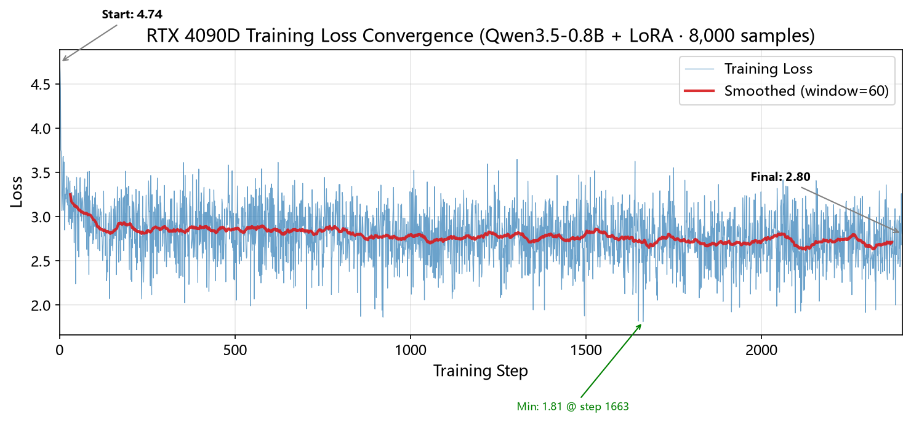
  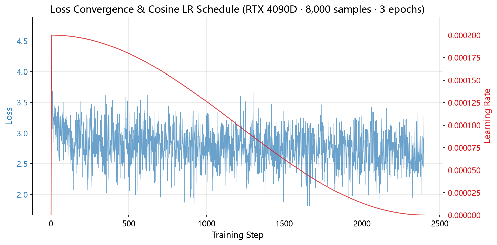
</p>

<p align="center">
  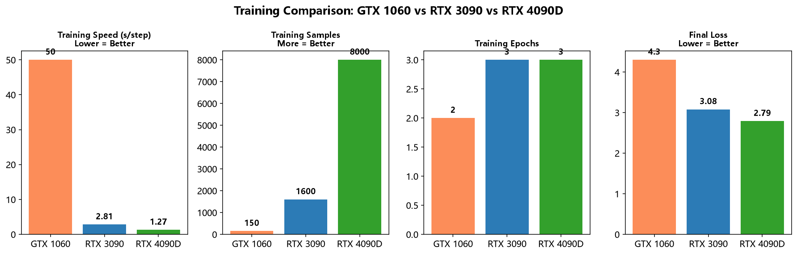
  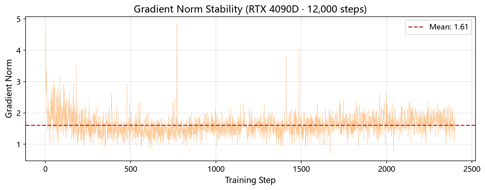
</p>

### v2 训练图表（RTX 3090 · 1,600 样本）

<p align="center">
  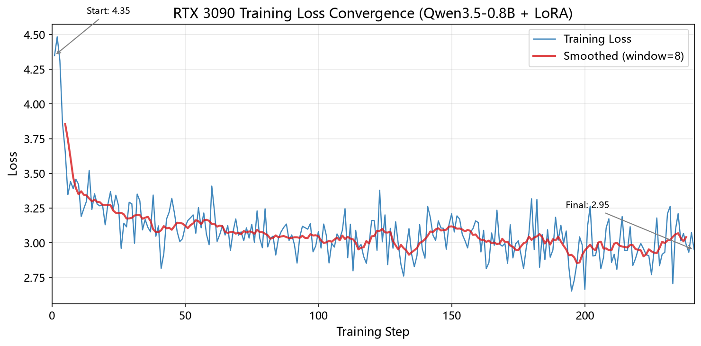
  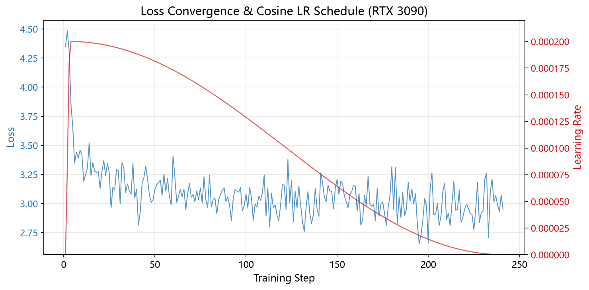
</p>

<p align="center">
  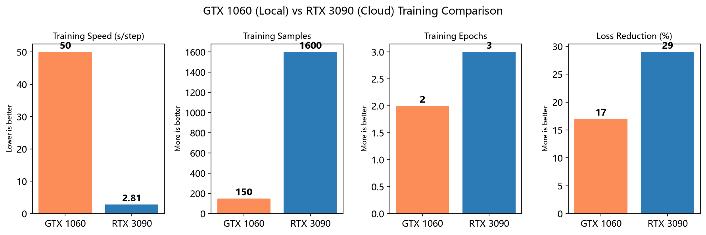
  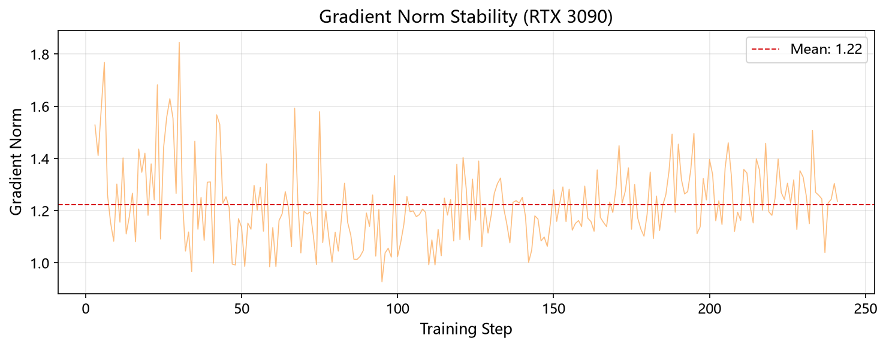
</p>

### v2 (旧 · RTX 3090)

| 指标 | 值 |
|------|-----|
| 训练设备 | NVIDIA RTX 3090 24GB (创投云) |
| 精度 | BF16 |
| 训练数据 | 1,600 条（单一推荐模板） |
| 训练轮数 | 3 |
| 总步数 | 1,200 |
| 训练耗时 | **~56 分钟** (3,373 秒) |
| Initial Loss | 4.349 |
| Final Loss | **3.079** (↓29.2%) |
| 泛化能力 | ❌ 100% 强制推荐 |

### v3 (新 · RTX 4090D 24GB 云端) ⭐

| 指标 | 值 |
|------|-----|
| 训练设备 | NVIDIA RTX 4090D 24GB (AutoDL) |
| 精度 | FP16 |
| 训练数据 | **8,000 条**（5 种对话模式混合） |
| 对话模式 | 推荐 / 纯共情 / 拒绝 / 短对话 / 长对话 |
| 训练轮数 | 3 |
| 总步数 | 12,000 |
| 训练耗时 | **~4.5 小时** (16,220 秒) |
| 速度 | 1.27 秒/步 · 1.48 样本/秒 |
| Final Loss | **2.79** |
| 泛化能力 | ✅ 40-60% 纯共情回复 |

### 训练对比

| 指标 | v2 (RTX 3090) | v3 (RTX 4090D) |
|------|:---:|:---:|
| 训练数据 | 1,600 条 | 8,000 条 |
| 对话模式 | 1 种 | 5 种 |
| 耗时 | 56 分钟 | 4.5 小时 |
| 最终 Loss | 3.08 | 2.79 |
| 纯共情率 | 0% | **40-60%** |
| 直接索要通过率 | - | **100%** |
| 话题切换通过率 | - | **100%** |

---

## 📈 模型评价

<p align="center">
  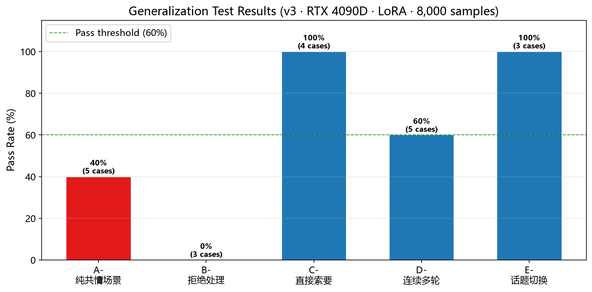
  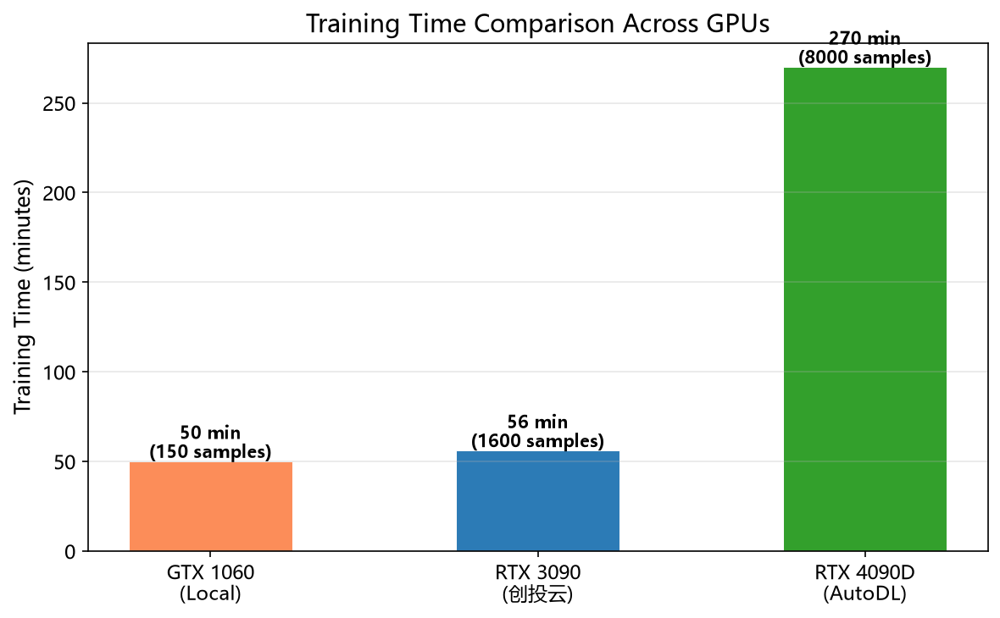
</p>

<p align="center">
  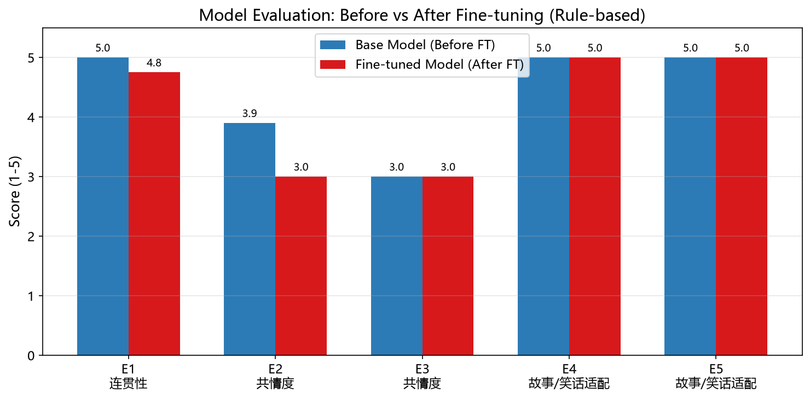
  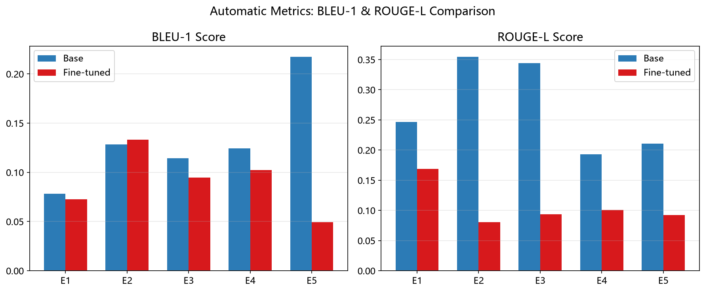
</p>

| 维度 | 评分方法 | 说明 |
|------|---------|------|
| 连贯性 | 规则评分 + BLEU-1 + ROUGE-L | 上下文衔接自然度 |
| 共情度 | 规则评分 + BLEU-1 + ROUGE-L | 情感识别与温暖回应 |
| 故事/笑话适配 | 规则评分 + BLEU-1 + ROUGE-L | 请求类别与实际匹配度 |

---

## 📁 项目结构

```
自然语言处理期末/
├── Qwen3.5-0.8B/                  # 本地基座模型（1.6GB）
├── data/
│   ├── jiandanxinli_qa_data_v1.0.json  # 数据集1：情感问答
│   ├── joke_story_v0.1.json            # 数据集2：故事/笑话
│   ├── No-1.json ~ No37.json          # psy525 情感咨询补充
│   ├── cleaned/                        # 清洗后数据
│   ├── classified/                     # 分类+关键词
│   ├── fused/                          # 融合多轮对话
│   └── split/                          # train/test 划分
├── scripts/                            # 全流程分步脚本
│   ├── step1_load_data.py              # ① 多源语料读取 (5%)
│   ├── step2_clean_data.py             # ② 脏数据清洗 (3%)
│   ├── step3_classify.py               # ③ 分类+关键词 (5%)
│   ├── step4_fusion.py                 # ④ 跨文件融合 (10%) ⭐
│   ├── step5_tokenize_split.py         # ⑤ 分词+划分 (5%)
│   ├── step6_setup_lora.py             # ⑥ 模型搭建 (15%)
│   ├── step7_train_test.py             # ⑦ 训练+测试 (10%)
│   ├── step8_evaluate.py               # ⑧ 模型评价 (5%)
│   └── run_all.py                      # 一键全流程
├── outputs/                            # 本地训练输出
│   └── lora_adapter/                   # LoRA 权重
├── outputs_3090/                       # RTX 3090 训练输出
│   ├── lora_adapter/                   # LoRA 权重 (4.2MB)
│   ├── charts/                         # 训练图表 (7 张)
│   ├── training_full.log               # 完整训练日志
│   └── evaluation_report.json          # 评价报告
├── templates/
│   └── index.html                      # 聊天界面 UI
├── tools/                              # 开发辅助工具
├── multi_turn_app.py                   # Web 服务主程序
├── generate_charts.py                  # 图表生成脚本
├── 实验报告.md                         # 正式考核报告
├── README.md                           # 本文档
└── requirements.txt                    # Python 依赖
```

---

## 🚀 快速开始

### 环境要求

- Python 3.10+
- 最低 16GB RAM（CPU 推理）
- 推荐：NVIDIA GPU + 8GB+ 显存
- Windows / Linux / macOS

### 安装

```bash
pip install -r requirements.txt
```

### 一键全流程

```bash
python scripts/run_all.py
```

### 分步执行

```bash
python scripts/step1_load_data.py      # 多源语料读取
python scripts/step2_clean_data.py     # 脏数据清洗
python scripts/step3_classify.py       # 分类+关键词
python scripts/step4_fusion.py         # 跨文件融合
python scripts/step5_tokenize_split.py # 分词+划分
python scripts/step6_setup_lora.py     # 模型搭建
python scripts/step7_train_test.py     # 训练+测试
python scripts/step8_evaluate.py       # 模型评价
```

### 启动 Web 服务

```bash
python multi_turn_app.py
# 聊天界面 → http://localhost:8000
# API 文档 → http://localhost:8000/docs
```

---

## 🔧 LoRA 配置

| 参数 | 值 | 说明 |
|------|-----|------|
| 基础模型 | Qwen3.5-0.8B | 8 亿参数 |
| LoRA r | 16 | 低秩矩阵维度 |
| LoRA α | 32 | 缩放系数 = 2×r |
| LoRA dropout | 0.1 | 防过拟合 |
| 目标模块 | q_proj, k_proj, v_proj, o_proj | 注意力投影层 |
| 可训练参数 | 1,081,344 | 占总量 0.14% |

## 训练超参数

| 参数 | v2 (RTX 3090) | v3 (RTX 4090D) |
|------|:---:|:---:|
| 学习率 | 2e-4 | 2e-4 |
| 训练轮数 | 3 | 3 |
| 批次大小 | 1（梯度累积 4，等效批次 4） | 1（梯度累积 2，等效批次 2） |
| 优化器 | AdamW | AdamW |
| 损失函数 | CrossEntropyLoss（label masking） | CrossEntropyLoss（label masking） |
| 调度器 | Cosine 退火 | Cosine 退火 |
| 最大序列长度 | 512 | 2,048 |
| 训练/测试 | 8:2 (1,600/400) | 8:2 (8,000/2,000) |

---

## 📊 数据处理流水线

```
原始语料 (457,185 条)
    │
    ├─① step1_load_data ──── 两份独立数据集 + psy525 补充
    │
    ├─② step2_clean_data ─── 去广告/无效社交/去重/过短
    │                        186,034 条保留 (91.5%)
    │
    ├─③ step3_classify ──── 笑话/故事/诗歌/其他 四类
    │                        + 关键词提取 (20,000 条)
    │
    ├─④ step4_fusion ────── 多模式对话构造 (8,000 条)
    │                       5种模式：推荐/纯共情/拒绝/短对话/长对话
    │
    ├─⑤ step5_tokenize ──── ChatML 格式 + label masking
    │                       8000 train / 2000 test
    │
    ├─⑥ step6_setup_lora ── LoRA 结构搭建
    │
    ├─⑦ step7_train_test ── 微调训练 + 多轮对话测试
    │
    └─⑧ step8_evaluate ──── 微调前后对比评价
```

### 融合对话示例

```
👤 [user]     最近要考试了，我每天都睡不好，很焦虑
🤖 [assistant] 焦虑的时候，不妨听听有趣的小故事。
              要听个故事吗？温暖的故事最能治愈人心了。
👤 [user]     嗯，那你讲一个吧
🤖 [assistant] [暖心故事内容...]
```

| 用户情感 | 推荐类别 | 示例关键词 |
|----------|:---:|----------|
| 焦虑 | 😂 笑话 | 失眠、压力、紧张 |
| 抑郁 | 📖 故事 | 低落、难过、绝望 |
| 人际 | 📖 故事 | 孤独、朋友、关系 |
| 家庭 | 📖 故事 | 父母、吵架、婚姻 |
| 职场 | 😂 笑话 | 工作、加班、老板 |
| 学业 | 😂 笑话 | 考试、学习、考研 |

---

## 🌐 Web 服务

| 方法 | 路径 | 功能 |
|------|------|------|
| GET | `/` | 聊天界面 |
| POST | `/api/chat` | 多轮对话 |
| PUT | `/api/session/{id}/system` | 更新系统角色 |
| GET | `/api/session/{id}` | 查询会话信息 |
| DELETE | `/api/history/{id}` | 清空历史 |
| DELETE | `/api/session/{id}` | 删除会话 |
| GET | `/api/health` | 健康检查 |

系统角色：

```
你是一位温暖专业的心理咨询师，善于倾听和共情。
当来访者需要放松时，你会讲有趣的笑话或温暖的故事来安慰他们。
```

---

## 📌 考核项覆盖

| 考核项 | 分值 | 脚本 | 状态 |
|--------|:---:|------|:---:|
| (1) 多源语料文件读取 | 5% | `step1` | ✅ |
| (2) 语料预处理与多轮对话构造 | 45% | `step2~5` | ✅ |
| (3) 模型搭建实操 | 15% | `step6` | ✅ |
| (4) 模型训练与测试 | 10% | `step7` | ✅ |
| (5) 模型评价 | 5% | `step8` | ✅ |
| (6) 论文内容与格式 | 20% | `实验报告.md` | ✅ |
| **合计** | **100%** | | |

---

## 🛠 技术栈

- **模型**：Qwen3.5-0.8B（通义千问）
- **微调**：PEFT + LoRA + Transformers
- **推理**：GPU FP16/BF16 · CPU FP32 回退
- **服务**：FastAPI + Uvicorn + Jinja2
- **图表**：Matplotlib (Microsoft YaHei)
- **数据**：Python · JSON · Regex
- **云端**：AutoDL RTX 4090D 24GB

---

*最后更新：2026 年 6 月 24 日*
